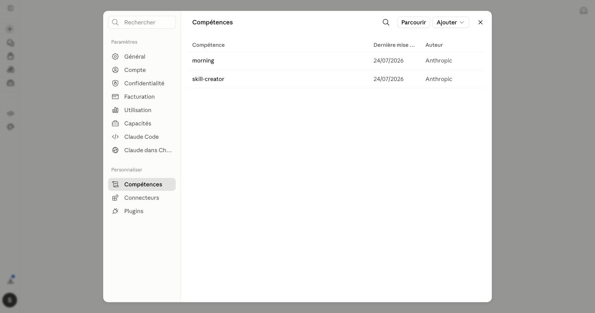
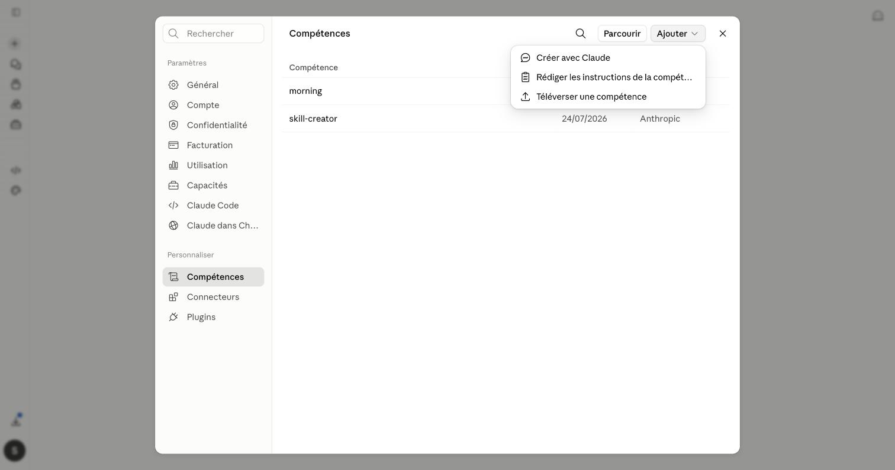
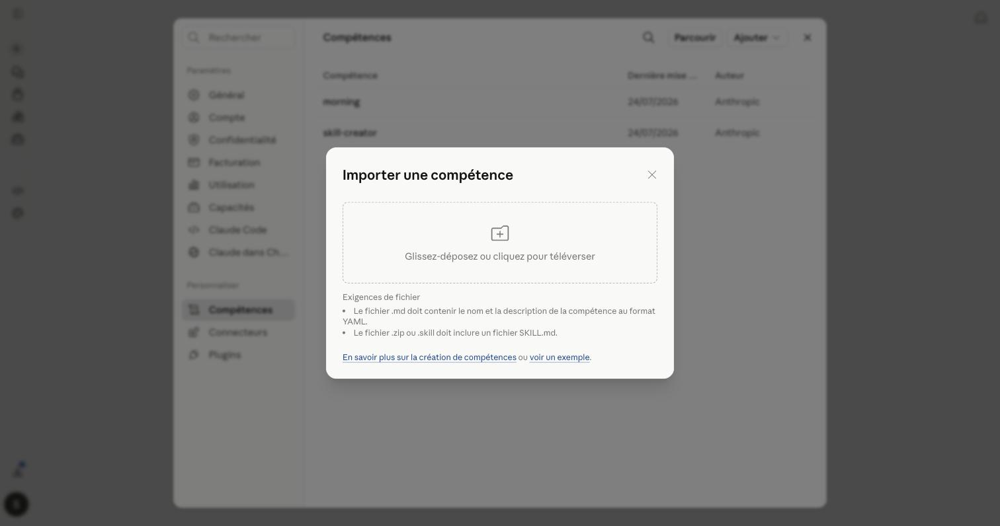
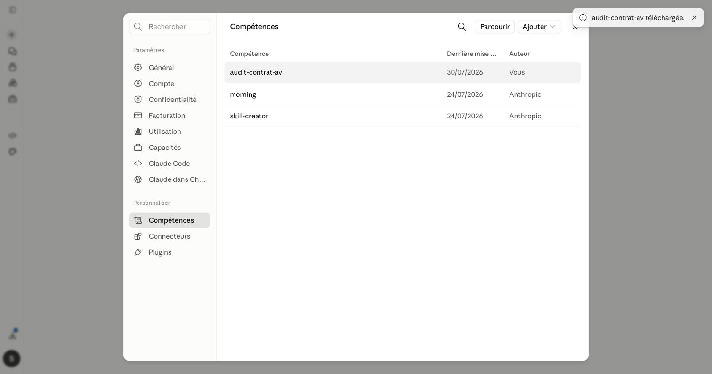

# Guide d'installation

Ce guide est écrit pour une personne qui **n'a jamais utilisé d'outil d'IA** et qui n'a **aucune compétence technique**. Prenez votre temps, suivez les étapes dans l'ordre. Chaque chapitre est autonome : vous pouvez vous arrêter au niveau qui vous suffit.

- **Chapitre 0** : avant de commencer (à lire une fois). ✅ rédigé
- **Chapitre 1** : niveau 1, les prompts (le plus simple, aucune installation). ✅ rédigé
- **Chapitre 2** : niveau 2, les skills. ✅ rédigé
- **Chapitre 3** : niveau 3, aller plus loin avec le Charlie Screener. ✅ rédigé
- **Annexes** : glossaire, cas de démonstration, personnalisation. ✅ glossaire rédigé

---

# Chapitre 0. Avant de commencer

⏱️ Lecture : environ 8 minutes.

## 0.1 À quoi sert ce package

Ce sont des **assistants** qui font le travail de préparation d'un dossier patrimonial : lire les pièces d'un client, les mettre en forme, repérer les points d'attention, décomposer des frais, préparer des projets de documents.

Ils font gagner un temps considérable sur la saisie et la mise en forme. Un cabinet nous a chiffré la ressaisie d'un seul questionnaire client à environ 30 minutes : c'est exactement ce que ces outils suppriment.

## 0.2 Ce que ces assistants ne font pas (important)

- Ils **ne décident pas** et **ne recommandent pas**. Ils préparent, vous validez et vous signez. La recommandation reste votre geste de professionnel, celui qui engage votre responsabilité.
- Ils ne remplacent ni un notaire, ni un avocat fiscaliste.
- Ils **ne calculent pas** les montants fiscaux complexes de tête : ils vous signalent les calculs à faire vérifier avec un outil dédié.
- Ils **refusent de travailler sans données**. Si vous ne donnez rien, l'assistant vous répond ce qui lui manque. C'est voulu : un document fabriqué sans pièces serait faux et vous exposerait.

## 0.3 La règle sur les données de vos clients (à lire absolument)

⚠️ **N'utilisez jamais de données nominatives réelles avec ces outils.**

Avant de coller le dossier d'un client dans l'assistant, **anonymisez-le** : remplacez le nom par « M. X », l'adresse par « [adresse] », les numéros de contrat par « [contrat 1 » ». L'assistant travaille tout aussi bien sur des données anonymisées, et vous protégez le secret de votre client.

C'est une règle non négociable du cabinet. En cas de doute, ne collez pas.

## 0.4 De quoi vous avez besoin

- Un ordinateur avec un navigateur internet (Chrome, Safari, Edge ou Firefox).
- Un **compte Claude**. Rendez-vous sur [claude.ai](https://claude.ai) et créez un compte (bouton « Sign up »). La version gratuite suffit pour découvrir ; la version payante (Pro) permet de traiter des dossiers plus longs et de joindre plus de documents.
- Les fichiers de ce package, téléchargés depuis GitHub (la marche à suivre est au chapitre 1).

Un **navigateur** est le logiciel avec lequel vous ouvrez des sites internet. Un **compte** est votre identité sur un site : une adresse email et un mot de passe.

## 0.5 Quel niveau choisir

- Vous voulez juste essayer, sans rien installer → **niveau 1, les prompts** (chapitre 1). Commencez par là dans tous les cas.
- Vous utilisez déjà Claude régulièrement et voulez que les barèmes soient à jour automatiquement → **niveau 2, les skills**.
- Vous voulez l'outil complet (analyse de portefeuille, simulateurs, recherche de supports) sans rien installer → **niveau 3, le Charlie Screener** (chapitre 3).

Vous pouvez commencer au niveau 1 aujourd'hui et monter plus tard. Rien n'est perdu.

---

# Chapitre 1. Niveau 1, les prompts

⏱️ Durée : environ 10 minutes pour votre premier bilan.

Un **prompt** est simplement un texte d'instructions que l'on donne à l'assistant. Vous le copiez, vous le collez, et l'assistant sait quoi faire. Aucune installation.

## 1.1 Récupérer les fichiers du package

1. Ouvrez la page GitHub du projet (le lien vous est fourni par le cabinet).
2. Cliquez sur le bouton vert **« Code »**, puis sur **« Download ZIP »**.
3. Dans votre dossier « Téléchargements », un fichier `.zip` est arrivé. Double-cliquez dessus pour l'ouvrir (il se décompresse tout seul).
4. Ouvrez le dossier obtenu, puis `01-prompts`. Vous y trouvez les fichiers de prompts, dont `bilan-patrimonial.md`.

Un fichier `.md` est un simple fichier texte. Vous pouvez l'ouvrir avec TextEdit (Mac) ou le Bloc-notes (Windows), ou même l'afficher directement sur GitHub sans rien télécharger.

## 1.2 Personnaliser l'en-tête (une fois pour toutes)

Ouvrez `bilan-patrimonial.md`. Tout en haut, une section « Votre cabinet » :

- Nom du cabinet
- Statuts ORIAS (COA, CIF, etc.)
- Ton souhaité pour les documents

Remplissez ces trois lignes avec les informations de votre cabinet. Gardez ce fichier personnalisé de côté : vous le réutiliserez pour chaque client.

## 1.3 Lancer votre premier bilan

1. Allez sur [claude.ai](https://claude.ai) et connectez-vous.
2. Cliquez pour démarrer une **nouvelle conversation**.
3. **Copiez tout le contenu** du prompt personnalisé et **collez-le** dans la zone de message. Envoyez.
4. L'assistant confirme son rôle. Vous pouvez maintenant lui fournir le dossier : collez le transcript du rendez-vous, et joignez les pièces (avis d'imposition, relevés) en cliquant sur le trombone. ⚠️ **Anonymisées** (voir 0.3).
5. Envoyez. L'assistant produit le bilan structuré.

## 1.4 Lire et vérifier la sortie

La sortie suit toujours le même plan (identité, revenus, actif, passif, prévoyance, objectifs, contraintes, points d'attention, données manquantes).

Trois choses à vérifier systématiquement :
- Les mentions **« donnée non disponible »** : ce sont les informations à réclamer au client. C'est normal et utile, pas une erreur.
- La section **« points d'attention »** : ce sont vos accroches de rendez-vous (épargne dormante, clause bénéficiaire à revoir, etc.). À vous de les transformer en conseil.
- Les **sources** entre crochets sur chaque donnée : elles vous permettent de vérifier en quelques secondes au lieu de tout refaire.

**Le document produit est un projet.** Relisez-le, corrigez-le, complétez-le, puis c'est vous qui le validez.

## 1.5 L'audit patrimonial

Même principe avec `audit-patrimonial.md`, mais pour analyser ce que le client détient déjà. Il lui faut deux entrées : les **situations de contrats** et le **profil de risque** du client. Sans elles, il refuse (et c'est normal). Il vous rendra une analyse par étages (enveloppe, assureur, contrat, supports), un tableau des frais, et des pistes chiffrées, sans jamais trancher à votre place.

## 1.6 Si ça ne marche pas

| Problème | Cause probable | Solution |
|---|---|---|
| L'assistant répond de façon générale, hors sujet | Le prompt n'a pas été collé en entier | Recommencez, sélectionnez bien tout le texte du fichier |
| Il invente un bilan sans que vous ayez donné de pièces | Vous n'avez rien joint, mais le comportement attendu est qu'il réclame les pièces | Vérifiez que vous avez la dernière version du prompt ; sinon signalez-le à l'équipe |
| Il n'arrive pas à lire une pièce | Photo floue ou document illisible | Fournissez une version nette, ou saisissez l'information à la main |
| La réponse s'arrête au milieu | Dossier trop long pour la version gratuite | Passez à Claude Pro, ou traitez le dossier en deux fois |

---

# Chapitre 2. Niveau 2, les skills

⏱️ Durée : environ 10 minutes, dont 5 pour le premier chargement.

Un **skill**, c'est un prompt du niveau 1 empaqueté une fois pour toutes, avec en plus votre contexte cabinet et un format de sortie soigné (PowerPoint, trame, courrier). Vous le chargez une fois dans Claude ; ensuite, il s'active tout seul dès que le sujet s'y prête. Fini le copier-coller à chaque conversation.

## 2.1 Télécharger un skill depuis GitHub

1. Ouvrez le dossier [`02-skills/`](../02-skills/) du projet.
2. Cliquez sur le dossier du skill qui vous intéresse (commencez par `audit-contrat-av/`).
3. Cliquez sur le fichier qui se termine par **`.zip`** (ici `audit-contrat-av.zip`).
4. Cliquez sur le bouton de téléchargement, en haut à droite du fichier (une flèche vers le bas, « Download raw file »).
5. Le fichier arrive dans votre dossier « Téléchargements ». **Ne le décompressez pas.**

## 2.2 Charger le skill dans Claude

1. Sur [claude.ai](https://claude.ai), cliquez sur vos initiales **en bas à gauche**, puis sur **Paramètres**.
2. Dans le menu de gauche, section « Personnaliser », cliquez sur **Compétences** (« Skills » si votre interface est en anglais).

3. En haut à droite, cliquez sur le bouton **Ajouter**, puis sur **Téléverser une compétence**.

4. Une fenêtre « Importer une compétence » s'ouvre : **glissez-y le fichier `.zip`** depuis votre dossier Téléchargements (ou cliquez sur la zone pour le sélectionner).
5. Le skill apparaît dans votre liste de compétences. C'est chargé, pour de bon : vous n'aurez plus jamais à refaire cette étape pour ce skill.

💡 Vous ne voyez pas la section « Compétences » ? Cette fonction fait partie des offres payantes de Claude et se déploie progressivement : vérifiez que vous êtes connecté avec le bon compte, ou restez au niveau 1 en attendant, il fait le même métier.

## 2.3 Votre premier audit avec le skill

1. Ouvrez une **nouvelle conversation** (inutile d'aller chercher le skill : il s'active tout seul).
2. Joignez un relevé de contrat d'assurance-vie **anonymisé** (⚠️ chapitre 0.3) avec le trombone.
3. Écrivez simplement : « Audit de ce contrat, profil équilibré, horizon 8 ans. »
4. Claude détecte le sujet, applique la grille du cabinet et produit l'audit, puis le PowerPoint de restitution.

Pas de contrat sous la main ? Testez avec le dossier fictif fourni : les notes de rendez-vous de la famille Martin (`02-skills/bilan-patrimonial/exemples/notes-rdv-cas-martin.md`) avec le skill bilan, en écrivant « Fais le bilan patrimonial de ce dossier ». Et pour voir à quoi doit ressembler le résultat : dossier [`02-skills/exemples/`](../02-skills/exemples/).

## 2.4 Le personnaliser pour votre cabinet

Dans chaque skill, **un seul fichier vous concerne** : `contexte-cabinet.md`.

1. Décompressez le `.zip` (double-clic).
2. Ouvrez `contexte-cabinet.md` avec TextEdit (Mac) ou le Bloc-notes (Windows).
3. Remplacez : nom du cabinet, statuts ORIAS, ton, couleurs et polices de votre charte.
4. Recompressez le dossier : clic droit sur le dossier → **Compresser** (Mac) ou **Envoyer vers → Dossier compressé** (Windows).
5. Rechargez ce nouveau `.zip` comme en 2.2 (supprimez l'ancien skill de la liste au passage, via les trois points à droite de son nom).

Ne touchez pas aux autres fichiers (grilles, trames, garde-fous) : c'est la méthode, et les garde-fous vous protègent.

## 2.5 Si ça ne marche pas

| Problème | Cause probable | Solution |
|---|---|---|
| « Le fichier .zip doit inclure un fichier SKILL.md » | Le zip a été décompressé puis recompressé au mauvais niveau | Le `SKILL.md` doit être directement dans le dossier zippé, pas dans un sous-dossier intermédiaire |
| Le skill ne se déclenche pas en conversation | Sujet trop éloigné de sa description | Nommez la tâche explicitement (« audit de ce contrat ») ; vérifiez que le skill est bien dans la liste |
| La sortie ignore votre charte | `contexte-cabinet.md` non personnalisé, ou ancien skill encore chargé | Refaites 2.4 et supprimez l'ancienne version de la liste |
| Pas de section Compétences dans les paramètres | Offre gratuite ou déploiement progressif | Voir l'encadré du 2.2 |

---

# Chapitre 3. Aller plus loin : le Charlie Screener

⏱️ Durée : 2 minutes, rien à installer.

Les prompts et les skills couvrent la préparation des dossiers. Pour aller plus loin, les briques du dossier de transmission que vous attendez peut-être ici (bilan patrimonial consolidé, audit du régime matrimonial, simulation de succession, calcul du démembrement, donation et quasi-usufruit) existent déjà, prêtes à l'emploi : ce sont des fonctionnalités du **Charlie Screener**, l'outil que nous avons développé pour les conseillers en gestion de patrimoine.

## 3.1 Ce que le Charlie Screener regroupe

- **Analyser** : le diagnostic d'un portefeuille existant (répartition, concentration, frais réels).
- **Simuler** : 42 simulateurs, du bilan patrimonial à la transmission (succession, démembrement, donation, régimes matrimoniaux), avec les barèmes officiels.
- **Rechercher** : un univers de supports (fonds, ETF, SCPI, produits structurés) avec filtres, pour trouver le bon support pour un client précis.
- **Comparer** : les contrats d'assurance-vie entre eux.
- **Construire** : une allocation adaptée au profil du client, frais détaillés à l'appui.

Là où un prompt ou un skill prépare un document, le Screener fait tourner les calculs avec les barèmes à jour : les deux se complètent. Par exemple : le skill `bilan-patrimonial` structure votre rendez-vous de découverte, puis le Screener chiffre la simulation de succession du même dossier.

## 3.2 Y accéder

👉 **[Découvrir le Charlie Screener](https://www.charliewealth.fr/landing)**

Rien à installer : c'est un outil en ligne. La page de présentation explique les fonctionnalités et comment y accéder.

---

# Annexe A. Glossaire

| Terme | Définition simple |
|---|---|
| **CGP** | Conseiller en gestion de patrimoine |
| **Prompt** | Texte d'instructions donné à l'assistant IA |
| **DER** | Document d'entrée en relation, remis au premier contact |
| **Recueil / KYC** | Le dossier de connaissance du client |
| **Rapport d'adéquation** | Le document qui justifie qu'une recommandation convient au client |
| **DIC / KID** | Document d'information clé d'un produit, contient le risque et les frais |
| **SRI** | Indicateur de risque d'un support, de 1 (prudent) à 7 (offensif) |
| **UC (unité de compte)** | Un support d'investissement à l'intérieur d'un contrat |
| **Fonds euros** | Support à capital garanti |
| **Rétrocession** | Part des frais reversée au conseiller |
| **Enveloppe** | Le cadre fiscal : assurance-vie, PER, PEA, compte-titres |
| **Arbitrage** | Changer la répartition des supports dans un contrat existant |
| **Rachat** | Retirer de l'argent d'un contrat |

---

# Annexe B. Cas de démonstration

Deux dossiers fictifs et anonymisés sont fournis dans `01-prompts/cas-test/` pour vous entraîner sans risque avant de traiter un vrai client. Chacun contient des points d'attention à repérer.
